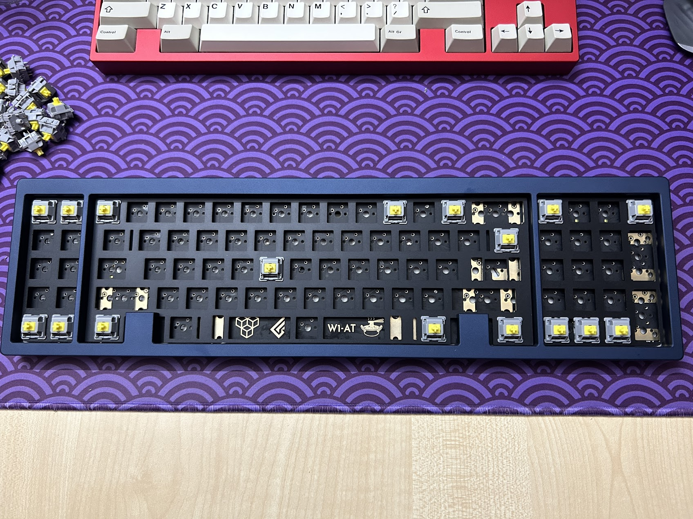

# W1-AT Plate files

Plate files for Geonworks [W1-AT keyboard](https://geon.works/pages/w1-at)  

## Structure  
The `./dxf_files` folder contains the DXF files for the Aluminium plates  

## Pictures

## Disclaimer  
The DXF files are of my authorship. Everything is licensed under the MIT License. Even so, please contact Geon before using them commercially.  
I provide these files without liability and without any guarantees regarding functionality.